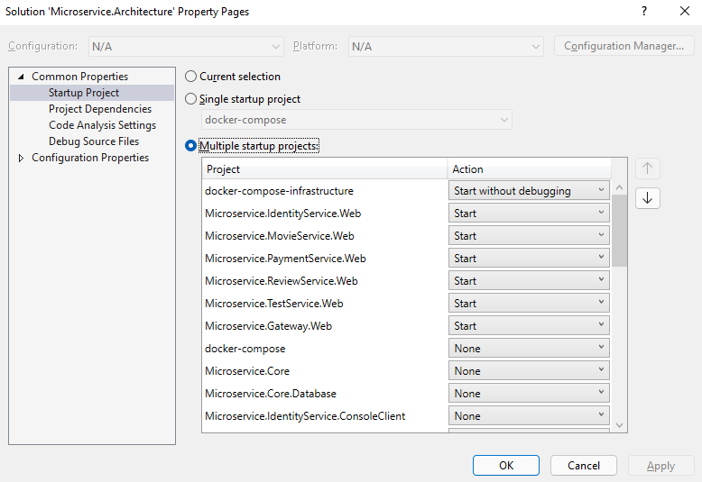

> This project was created for educational purposes and to consolidate the acquired knowledge.
> 
> Keep in mind that the implementation is ongoing and some modules may work with bugs.

## About

This demo shows a working sample of microservices architecture using ASP.NET Core. It covers how to create microservices, how to create API gateways using Ocelot and how to deploy microservices using Docker containers.

## Diagram


## Quick Start

The fastest and easiest way to run this project is a [Kubernates Cluster](#kubernates-cluster). You just need to install [Docker Desktop](https://docs.docker.com/desktop/windows/install/) and [Minikube](https://minikube.sigs.k8s.io/docs/start/) tools. Instead of building sources you can use latest version of images from public Docker Hub registry ([romanbilyak](https://hub.docker.com/u/romanbilyak)). Go to the folder [deploy](deploy) and run [run.ps1](deploy/run.ps1) script with specified registry parameter.

PowerShell:

```
.\run.ps1 -registry 'romanbilyak'
```

CMD:

```
run -registry 'romanbilyak'
```

Other methods of running this project are described below:

### Kubernates Cluster

Prerequisites:

- [.Net 6.0](https://dotnet.microsoft.com/en-us/download/dotnet/6.0)
- [Docker Desktop](https://docs.docker.com/desktop/windows/install/)
- [Minikube](https://minikube.sigs.k8s.io/docs/start/)
- [Kubernates](https://kubernetes.io/releases/download/)

Go to the folder [deploy](deploy) and run [run.ps1](deploy/run.ps1) or [run.cmd](deploy/run.cmd) script.

#### Examples

PowerShell:

```
.\run.ps1 -nodes 2 -cpus 4 -memory 4096 -r 'localhost:5000' -t 'v1.0' -b
```

CMD:

```
run -nodes 2 -cpus 4 -memory 4096 -r 'localhost:5000' -t 'v1.0' -b
```

#### Supported params:

| Param     | Short Form | Default | Description                              |
| --------- | ---------- | ------- | ---------------------------------------- |
| -nodes    | -n         | 1       | Number of nodes.                         |
| -cpus     | -c         | 2       | Number of CPUs allocated to Kubernetes.  |
| -memory   | -m         | 2048    | Amount of RAM to allocate to Kubernetes. |
| -registry | -r         | ''      | Name of docker images registry.          |
| -tag      | -t         | ''      | Tag of images.                           |
| -build    | -b         | false   | Flag to build images.                    |

The script will:

1. Start Kubernates Cluster localy using Minikube.

2. Build microservices images.

3. Push images to specified registry.
   
   > In a case when registry is not specified images will be pushed into Docker Deamon of cluster.
   
   > In a case when registry is set to 'localhost:5000' local registry inside cluster will be created.

4. Deploy services to local Kubernates Cluster.

5. Expose gateway service and start Kubernates Cluster dashboard.

Go to http://localhost to view gateway methods.

### Local Docker Host

Prerequisites:

- [.Net 6.0](https://dotnet.microsoft.com/en-us/download/dotnet/6.0)

- [Docker Desktop](https://docs.docker.com/desktop/windows/install/)
1. Go to the folder [deploy\docker-compose-infrastructure](deploy/docker-compose-infrastructure) and run the following docker-compose command in CMD or PowerShell:
   
   ```
   docker-compose -f docker-compose.yml -f docker-compose.override.yml up
   ```

2. Go to the folder [deploy\docker-compose](deploy/docker-compose) and run the following docker-compose command in CMD or PowerShell:
   
   ```
   docker-compose -f docker-compose.yml -f docker-compose.override.yml up
   ```

### Visual Studio

Prerequisites:

- [Visual Studio 2022 Preview](https://visualstudio.microsoft.com/vs/preview/)
- [Docker Desktop](https://docs.docker.com/desktop/windows/install/)

Set **gateway** and **microservices** as startup projects. Your can also run the **docker-compose-infrastructure** project instead of installing and configuring infrastructure services by yourself.



## Applications & Microservices

|                  | [Visual Studio](#visual-studio)         | [Local Docker Host](#local-docker-host) | [Kubernates Cluster](#kubernates-cluster) |
| ---------------- | --------------------------------------- | --------------------------------------- | ----------------------------------------- |
| angular-ui       | [localhost:7001](http://localhost:7001) | [localhost:9001](http://localhost:9001) |                                           |
| react-ui         | [localhost:7002](http://localhost:7002) | [localhost:9002](http://localhost:9002) |                                           |
| gateway          | [localhost:7100](http://localhost:7100) | [localhost:9100](http://localhost:9100) | [localhost](http://localhost)             |
| identity-server  | [localhost:7111](http://localhost:7111) | [localhost:9111](http://localhost:9111) |                                           |
| identity-service | [localhost:7201](http://localhost:7201) | [localhost:9201](http://localhost:9201) |                                           |
| movie-service    | [localhost:7202](http://localhost:7202) | [localhost:9202](http://localhost:9202) |                                           |
| review-service   | [localhost:7203](http://localhost:7203) | [localhost:9203](http://localhost:9203) |                                           |
| payment-service  | [localhost:7204](http://localhost:7204) | [localhost:9204](http://localhost:9204) |                                           |
| test-service     | [localhost:7205](http://localhost:7205) | [localhost:9205](http://localhost:9205) |                                           |

## Project Structure

- **applications** - 

- **core** - 

- **deploy** -

- **microservices** -

- **tests** -

## Layered Architecture

This project implements **NLayer architecture** and **Domain Driven Design**

### Shared Infrastructure Layer

- Database
  
  - EF Core

- Ast.Net Core

### Domain Layer

- Entities

- Specifications

- Validation Rules

- Managers

### Infrastructure Layer

- Database contexts

### Application Layer

- Application services

### Web Layer

Root layer for microservice's layers

- Controllers

- View Models

### Test Layer

- Unit Tests

## Technologies

- [x] [Swagger UI](https://swagger.io/tools/swagger-ui/)
- [x] [Ocelot API gateway](https://github.com/ThreeMammals/Ocelot)
- [ ] [Serilog](https://serilog.net/)
- [x] [CQRS pattern](https://docs.microsoft.com/en-us/azure/architecture/patterns/cqrs)
- [ ] [Event Sourcing pattern](https://docs.microsoft.com/en-us/azure/architecture/patterns/event-sourcing)
- [x] [MediatR](https://github.com/jbogard/MediatR)
- [ ] [MassTransit](http://masstransit-project.com/)
- [ ] [RabbitMQ](https://www.rabbitmq.com/)
